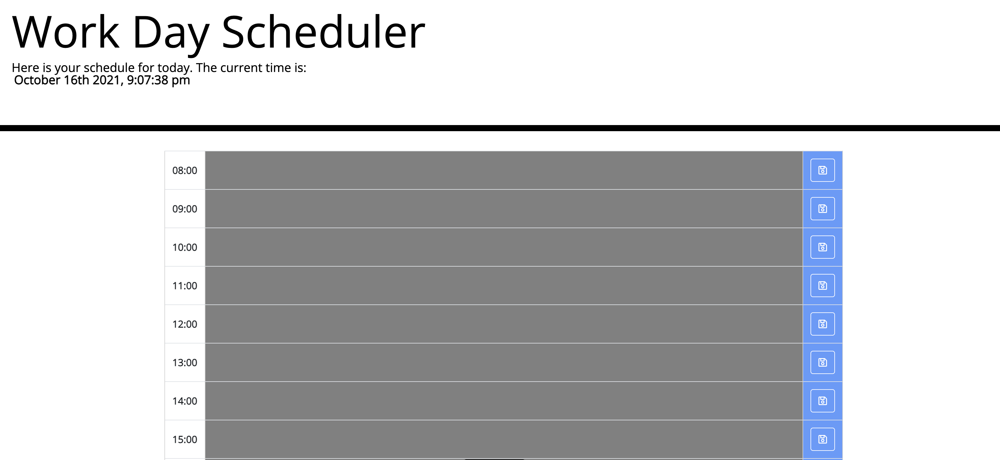
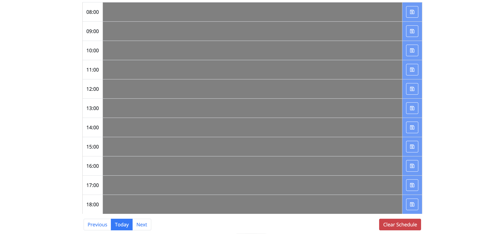

# 05 Third-Party APIs: Work Day Scheduler

## Your Task

Create a simple calendar application that allows a user to save events for each hour of the day by modifying starter code. This app will run in the browser and feature dynamically updated HTML and CSS powered by jQuery.

You'll need to use the [Moment.js](https://momentjs.com/) library to work with date and time. Be sure to read the documentation carefully and concentrate on using Moment.js in the browser.

## User Story

```md
AS AN employee with a busy schedule
I WANT to add important events to a daily planner
SO THAT I can manage my time effectively
```


For this assignment we were tasked to build a daily planner. I decided to build mine from 8:00 AM to 6:00 pm to cover the usual 9-5 hours for someone in a business environment. After getting my time using moment and my styles down, I dove into the fun stuff with javascript making all my functions. I ran into a little trouble with actually finding time to do this assignment (luckily I was somehow able to get it done) from launch weekends at work and dealing with leadership duties, to finding time outside of class time to work on this. Overall its here and I think its working like its suppossed to!

Here is a few images of the page itself, and of course the links as well! 

[WorkDay Planner]()
[Repository](https://github.com/joecliffordofficial/workdayplanner_hw5)


